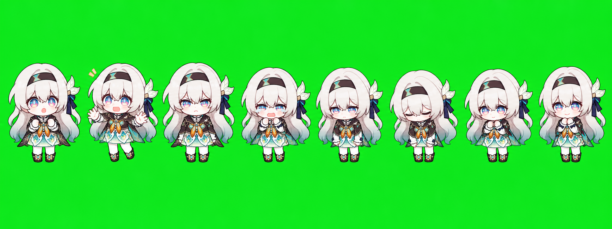

### codex 流萤桌宠


1.  git clone git@github.com:zihui7896/pets.git
2.  把 liuying-kawaii 文件夹放到 .codex/pets/ 文件夹下
3.  在 codex 外观 宠物选择这个


#### Skill

这个 skill 叫 `image2-codex-pet`，作用是：把一张或多张角色参考图，做成 Codex 桌面宠物能识别、能选择、带多种动作的宠物包。

它不只是生成一张图，而是完整产出一套桌宠资源：

- `pet.json`：让 Codex 识别这个宠物
- `spritesheet.webp`：最终可用的 8x9 动作精灵图
- `spritesheet.png`：方便查看/编辑的版本
- 每个动作的预览 GIF
- 每帧拆开的中间文件，方便继续修改
- contact sheet 总览图，用来检查动作是否正常

**默认动作结构**
这个 skill 会按 Codex 固定格式生成 9 行动作：

```
idle           站立 / 待机
running-right  向右跑
running-left   向左跑
waving         挥手
jumping        跳跃 / 开心
failed         失败 / 哭泣 / 惊讶
waiting        等待 / 思考
running        正面活泼跑步 / 冲刺感动作
review         看文档 / 思考 / 检查
```

**实际工作流程**
它会先根据参考图锁定角色特征，比如：

```
白灰长发
蓝粉渐变眼睛
黑色发带
右侧叶片发饰
黑金青配色衣服
软萌 Q 版比例
```

然后用 Image2 / image_gen 生成：

```
基础角色图
每行动作 sprite strip
最终 spritesheet.webp
每行动作 GIF
可继续编辑的逐帧 PNG
```

最后把宠物包安装到：

```
C:\Users\Administrator\.codex\pets\<pet-id>\
```

这样 Codex 才能在宠物选择里看到它。

**最简单的用法**
直接说：

```
用 image2-codex-pet 根据 C:\xxx\图片文件夹 生成一个 Codex 可选择的桌宠
```

#### liuying-kawaii


#### liuying-image2





